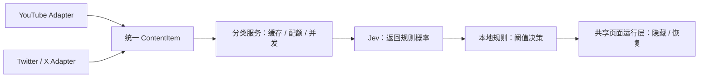

# TubeGate

按你的规则，过滤 YouTube 推荐和 Twitter / X 帖子。用自然语言定义不想看的内容，支持自定义主题、保留条件和一键恢复。两站共用规则、API Key 和每日配额。

Chrome Manifest V3 扩展；采用可扩展的网站适配器架构，提供独立的 YouTube 与 Twitter / X 适配器。Jev 负责分类评分，本地规则决定是否隐藏。

## 安装

需要 Node.js 20+。源码、构建工具和非 UI 测试采用严格 TypeScript；没有第三方运行依赖。

```sh
npm ci
npm test
npm run check
npm run package
```

打开 `chrome://extensions`，开启开发者模式，选择“加载已解压的扩展程序”，加载本项目的 `dist/` 目录。配置自己的 TypeSafe API Key，然后刷新已打开的 YouTube 或 X 页面。源码修改后重新打包、重新加载扩展，再刷新目标页面。

## 设计预览

```sh
npm run preview
```

打开 `http://127.0.0.1:4173/src/settings.html`；同目录的 `popup.html` 和 `onboarding.html` 可查看弹窗和引导页。预览带有明确的示例提示，规则修改只保留在当前页面，不连接真实 API、不读写扩展设置。预览代码不进入 `dist/`。

`npm run check` 检查全部 TypeScript 类型，`npm test` 运行非 UI 测试，`npm run package` 检查类型并由 esbuild 生成六个浏览器入口。Chrome 加载生成的 JavaScript；请加载 `dist/`，不要直接加载仓库根目录。

## 功能和范围

- 检查桌面版 `www.youtube.com` 首页、搜索结果和播放页侧栏；兼容传统 renderer 与新 lockup 卡片结构，包括这些区域里的 Shorts 推荐卡片。
- Twitter / X：支持 `x.com`、`twitter.com` 及各自的 `www` 主机，处理首页信息流、搜索结果和帖子详情页中的回复；详情页主帖保留。
- X 只读取帖子作者和正文；引用帖不混入外层帖子的身份或正文。纯媒体无正文、无可靠帖子链接的卡片保持显示，不自动展开长文。
- 依据 YouTube 视频标题、频道名、卡片描述，或 X 帖子作者、正文判断。**不分析缩略图、视频画面或音轨**；只有画面包含问题而文字正常的视频可能漏过。
- 默认过滤色情/性暗示、色情引流、诈骗/垃圾营销；内置规则可编辑，也可以添加“游戏实况”“某个频道”等自定义规则及排除条件。
- 命中后显示原因和可恢复占位符；关闭详细占位符后仍保留恢复入口。恢复对当前页面生效，重新检查、切换页面或更新设置后重新按规则判断。
- 支持滚动加载、站内无刷新跳转、卡片数据复用；只主动检查视口附近的卡片，避免对未浏览的大量推荐发起请求。
- YouTube 不处理当前播放器、评论、频道页、订阅页、历史记录、播放列表页、独立 Shorts 播放页及手机站。不控制 YouTube 自动播放，也不阻止视频链接直接访问。
- X 不处理私信、通知、书签、个人资料页、发帖框或图片/视频弹层；只在主信息流区域提取正文，不读取侧栏和登录信息。
- API 失败、响应格式错误、无 Key 或达到配额时保持显示。失败结果不会自动反复重试；可点卡片的重试按钮。
- 设置约 3 秒内同步到已打开页面；清除缓存后需刷新目标页面重新检查。

## 自定义不想看的内容

扩展弹窗 → **自定义我不想看的内容** → **添加规则**，写明规则名称、隐藏条件、保留条件和阈值，保存后启用。也可以点击“政治 / 时政”“游戏实况”“娱乐八卦”示例，修改草稿后保存；示例不会自动加入或启用。

例如政治相关内容：

- 名称：政治 / 时政。
- 隐藏：以当代政治、政党、选举、政治人物、政府政策争论或国际政治冲突为主要话题的内容，不区分国家或立场。
- 保留：历史知识、政治学基础课程，以及只顺带提到政治人物或国家名称的内容。
- 阈值：80%；调高可减少误伤。

“政治敏感”没有替你固定好的判断范围；可以按自己的需要缩小到具体议题或频道。任何一条启用规则命中都可能隐藏内容，保留条件只适用于当前规则。仅需自定义主题过滤时，可以关闭所有内置规则。

## 缓存和配额

默认每天最多 1,000 次内容分类请求，最多 3 个并发，缓存 24 小时、最多 500 项，存放于浏览器会话存储。关闭浏览器会丢弃分类缓存。每日计数按 UTC 日期重置。手动连接测试单独调用 API，不计入内容分类配额。

缓存只保存输入与规则的摘要、分类概率及时间，不保存标题等原文。阈值变动会重新应用已缓存的概率；规则文字或模型变化会重新请求。并发重复内容共用请求，失败不自动重试。

## 数据流

API Key 存于当前扩展的本地存储；页面脚本通过后台服务请求分类，不接收 Key。分类只向 `https://api.typesafe.ai/v1/systemone` 发送来源标识、内容类型、卡片文字和启用的规则，不发送页面 URL、内容 ID、Cookie 或浏览历史。调试关闭时不输出分类日志；开启后仅记录来源标识、内容 ID、内容摘要、延迟或错误代码。

仅申请 `storage`、`www.youtube.com`、`api.typesafe.ai`、`x.com`、`www.x.com`、`twitter.com` 与 `www.twitter.com` 的精确主机权限。没有申请 history、cookies、webRequest 或全站访问权限。扩展设置与 elons-job 独立，不会自动读取其 Key。

## 架构



- `src/adapters/youtube/`：YouTube URL、DOM 提取、范围、导航事件与网站样式。
- `src/adapters/twitter/`：Twitter / X 路由、帖子提取、引用隔离和范围。
- `src/core/content.ts`：统一数据结构与校验；剔除 URL、DOM 等无关字段。
- `src/core/adapters.ts`：适配器注册与匹配。
- `src/core/decision.ts`：与网站和供应商无关的概率阈值决策。
- `src/providers/jev*.ts`：Jev 请求协议、响应解析和网络调用。
- `src/services/`：可注入分类器的分类服务、缓存、配额与请求队列。
- `src/content.ts` 与 `src/content-twitter.ts`：分别加载本站适配器的入口。
- `src/runtime/content.ts`：共用页面扫描、状态管理和隐藏/恢复交互，不包含网站选择器。
- `src/background.ts`：后台组装与消息处理，API Key 留在后台。
- `src/shared/core.ts`：配置、规则、存储与摘要工具；保留旧存储键以兼容现有设置。

新增网站只添加适配器、必要的样式和精确域名权限，复用内容协议、分类服务和决策层。适配器由贡献者编写并随扩展打包，不运行远端脚本，也不是任意网站自动识别器。目前只支持 YouTube 与 Twitter / X。

开发细节见 [架构与接口](docs/architecture.md)、[新增适配器指南](docs/adapters.md) 和 [贡献指南](CONTRIBUTING.md)。

## 升级到 0.3

重新构建并加载 `dist/`，按 Chrome 提示启用新增的 Twitter / X 站点权限，再刷新目标标签页。两站共用现有 API Key、规则和每日额度；缓存按来源隔离。

未修改过文字的旧内置规则自动升级为同时适用于视频与帖子的描述，原阈值和启用状态保留。自定义规则以及改过文字的内置规则不变；若旧规则明确写了“只过滤 YouTube 视频”，需自行修改才能适用于帖子。规则文字变化会使对应缓存失效，下一次浏览可能重新调用 API。
