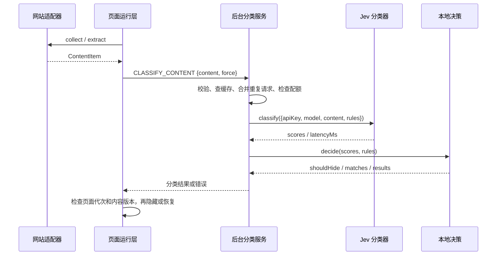

# TubeGate 架构与接口

目标是让网站来源和分类供应商各自可替换。产品当前有 YouTube 和 Twitter / X 两个来源，分类器使用 Jev；只申请对应站点的精确主机权限，不读取图片或音视频。

## 类型与构建

`src/types.ts` 定义 `ContentItem`、`ContentAdapter`、`Classifier`、规则、配置和消息请求/响应类型。外部内容与 Jev 响应以 `unknown` 接收并校验；类型不会替代运行时校验。`src/shared/messages.ts` 让每种消息的参数与响应对应，统一处理运行时断连与超时。

源码通过 ES 模块显式导入。`scripts/package.mts` 使用 esbuild 将 background、content、content-twitter、popup、settings、onboarding 六个入口打包为独立 IIFE，避免向网页泄露模块全局，也不依赖 `importScripts` 顺序。manifest 和 HTML 引用的是 `dist/` 中生成的 `.js`。TypeScript 源码、测试、预览模拟器不进入扩展包。

`tsconfig.json` 的严格检查覆盖源码、构建工具、预览工具和非 UI 测试。CI 先 `npm ci`，再检查、测试和打包。

扩展设置页的 `src/shared/scrollbars.ts` 绘制滚动条，保留滚轮和触控板的浏览器滚动行为；内容适配器不会向 YouTube 或 X 注入这套设置页滚动条。

## 数据流与边界



缓存命中时跳过 Jev，直接对缓存分数应用当前阈值。Jev 不直接操作 DOM，也不返回最终屏蔽决定。

## ContentItem

`src/core/content.ts` 定义、校验和规范化以下字段：

```js
{
  source: 'youtube',       // 稳定的适配器 ID
  id: 'dQw4w9WgXcQ',        // 来源内稳定内容 ID，仅用于本地
  type: 'video',           // 可扩展，如 video / post / comment
  title: '视频标题',        // 最多 1000 字符
  author: '频道名',         // 最多 300 字符
  text: '卡片上的描述'      // 最多 2000 字符
}
```

`source` 与 `type` 使用小写字母开头、最多 40 字符的字母/数字/下划线/连字符标识。`id` 必填，最多 200 字符。`title` 和 `text` 至少一个非空。文本去除不可见控制字符并折叠空白；可选文本字段缺省为空字符串。

额外字段被丢弃。DOM 节点、URL、视频文件和登录信息不进入数据协议。`serializeContent()` 只序列化 source、type、title、author、text；内容 ID 不发送至 Jev。

`identity()` 用 source/type/id 表示恢复操作对应的内容，`revision()` 还包含文本，避免复用卡片或更新标题时应用旧结果。内容类型不是硬编码枚举；新来源无需修改决策层。

## Adapter

`src/core/adapters.ts` 提供注册表，要求稳定 ID 和以下函数：

| 接口 | 职责 |
| --- | --- |
| `matches(url)` | 判断该来源是否负责这个 HTTPS 主机；不要使用宽泛子串匹配 |
| `getContext(url)` | 返回 `{key, ...sourceSpecificFields}`；不支持的页面返回 null |
| `collect(documentRoot, context)` | 返回当前候选卡片元素，去掉重复和嵌套候选 |
| `extract(element, context)` | 返回 ContentItem；缺字段、广告或当前播放内容返回 null |
| `isInScope(element, context)` | 同时检查元素仍连接、页面范围和可用状态 |

可选字段：`itemLabel` 控制“视频/内容”用语，`navigation.start/finish` 声明站点 SPA 事件，`observedAttributes` 声明需要监听的属性。没有导航事件时仍通过 popstate 与 URL 轮询识别页面变化。

运行层只认识这些接口。网站专属 DOM、链接和事件名称只存在于适配器。注册表拒绝重复 ID、不完整接口和多个适配器同时匹配，避免无声使用错误来源。

当前共享视图要求卡片根节点支持追加直接子节点，并允许隐藏其原有直接子元素。候选应是单条可恢复的内容容器，不能返回整列信息流、整个货架或播放器。新站点若不能满足该容器约定，应先扩展明确的视图接口，而不是向共享运行层塞网站判断。

## Twitter / X 适配器

`adapters/twitter/urls.ts` 只接受精确 HTTPS 主机，支持 `/home`、带查询的 `/search` 和标准帖子详情 URL；其他页面返回 null。`focusedContentId` 标记详情页主帖，在提取前排除。SPA 跳转由共用运行层的 URL 轮询、popstate 和 DOM 变化识别。

卡片必须位于主列、拥有外层作者区域内的时间戳永久链接，并带有外层帖子的正文。引用卡片和嵌套帖子不能提供外层帖子的 ID、作者或文字。提取 emoji 图片的文字替代，不读取媒体文件。缺正文或身份时保持显示。主列外、隐藏区域、对话框、已识别的广告容器均跳过。

YouTube 与 Twitter 的入口分别打包，通过构建依赖图检查相互隔离。它们共用 `runtime/content.ts`，网站选择器不进入运行层。

## Classifier

分类服务通过注入使用分类器，不导入 Jev：

```js
const classifier = {
  id: 'my-provider',
  async classify({ apiKey, model, content, rules }) {
    return { scores: { rule_id: 0.91 }, latencyMs: 120 };
  },
  async testConnection({ apiKey, model }) {
    return 120; // 当前设置页连接测试所需
  }
};
```

每条启用规则都必须返回有限的 0–1 数值分数。缺失、字符串或越界值视为无效响应，保持内容显示。`src/providers/jev-protocol.ts` 负责将规则转成 Jev questions，以及将 noul/pTrue 等响应转成分数；`src/providers/jev.ts` 负责鉴权、超时和请求。

分类器不重试，以保证一次内容分类消耗一次请求预算。添加重试时必须同步预算计数，不能在供应商内部偷偷增加调用。

`src/background.ts` 是组装入口。替换分类器实现时还要更新供应商相关的配置、设置页预览与准确的 API 主机权限；不需要修改 Adapter 或阈值决策。

## 规则、缓存与配置

自定义规则通过 normalizeRule 保存。`shared/default-rules.ts` 提供跨来源的内置规则，并仅对文字仍与 0.2 默认值完全相同的内置规则迁移措辞；阈值、开关、自定义规则和任何用户改过的文字都保留。两站共用规则、API Key、统计和每日配额。

缓存摘要包含完整序列化内容、启用规则的语义、模型、供应商 ID 和版本。source/type 在序列化内容中，因此不同来源不会混用；同来源相同文字可以跨内容 ID 复用分数。阈值与规则名称不影响分数缓存，命中后用当前配置重新决定。

只保存分数和时间，不保存原文。最多 500 项。清空缓存时递增代次，清空前已经在途的请求不会重新写回。配额和统计更新串行执行，队列限制同时运行的请求。等待中的任务执行前会复核配置。

`socialMediaGateConfig` 等存储键继续保留；旧的 `globalThis.SocialMediaGate` 命名空间已改为 ES 模块导入，避免品牌改名使旧设置失效。新消息为 `CLASSIFY_CONTENT` 和 `RECORD_CONTENT_EVENT`，不再使用视频专属消息。扩展升级后应刷新已打开的页面。旧消息不会发起 API 调用；旧格式缓存通过缓存版本隔离。

## 验证边界

非 UI 测试覆盖数据协议、适配器注册与打包入口、另一来源和另一分类器复用服务、分数格式、缓存隔离、配额、并发和配置保留。测试不调用 DOM 提取方法，不为界面或布局编写单元测试。
